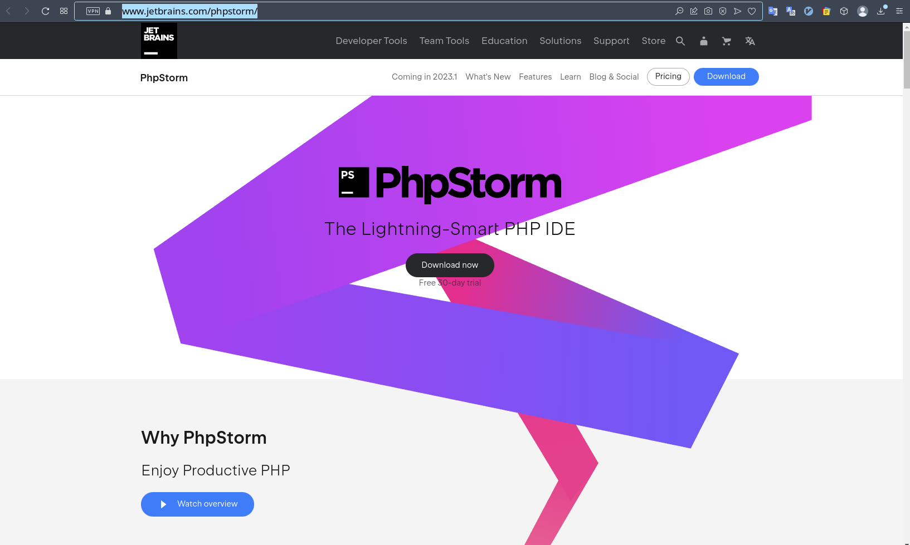

## Strona zadeklarowana dla uczniów technikum "technik programista" 
### *Jekyll theme  [zobacz projekt szablonu Jekyll](http://pages-themes.github.io/hacker) 
### [Skanowanie kalilinux](./Net_scan.md)
### [Git w CMD.exe windows ](./git_windows.md)
### [Zakładanie konta na github](./another-page.md)
### [Schematy blokowe](./algorytmy.md)
### [USB bootable](./usbboot.md)
### [Strony powiązane. Konkursy dla programisty](http://programista1a.site)

##  W tym roku udało się pozyskać licencje edu firmy. Normalnie produkt jest płatny i drogi. Pod długiej wymianie wiadomości mailowych z developerami firmy, obyło się bez euro legitymacji [jetbrains.](https://www.jetbrains.com/products)

### zakres algorytmiki w I semestrze klasy pierwszej. 
### 1.[Oprogramowanie do pisania stron. **js**](./https://www.jetbrains.com/phpstorm/)
### 
PhpStorm jest idealny do pracy z Symfony, Laravel, Drupal, WordPress, Zend Framework, Magento, **Joomla!**, CakePHP, Yii i innymi frameworkami
Wykorzystaj w pełni najnowocześniejsze technologie front-end, takie jak HTML 5, JavaScript, CSS, Sass, Less, Stylus, CoffeeScript, TypeScript, Emmet z refaktoryzacją.

***Dlaczeg więc programiści piszą w programie visual studio?. Bo jest darmowy.  Kto więc używa jetbrains?.  Duże firmy, korporacje development.***

##  Wymagania edukacyjne
### czyli ile procent na jaką ocenę?
<iframe src="https://show.zohopublic.com/publish/pegpr4079fd7e682f44f49a7cd26c86763a6d" height="563" width="395" name="_Przedmiotowy%20system%20oceniania%20Programista%20w%205%20letnim%20toku%20nauczania" scrolling=no frameBorder="0" style="border:1px solid #AABBCC" allowfullscreen="true" mozallowfullscreen="true" webkitallowfullscreen="true"></iframe>


* * *

### Linki do materiałów pdf:

1. [Python](https://drive.google.com/drive/folders/13pR3LL6UMCNZz09_yeIj3gIQRAQDXww3?usp=share_link)
2. [C++](https://docs.google.com/document/d/1ZwpNzletq-gW2Pj4nE3uNbVGeXjvHTOL/edit?usp=sharing&ouid=117430536303352971908&rtpof=true&sd=true)

### Przydatne strony:
1. [Python](https://python101.readthedocs.io/pl/latest/podstawy/index.html#materialy)
2. [C++](https://cpp0x.pl/kursy/Kurs-C++/1)


```
Long, single-line code blocks should not wrap. They should horizontally scroll if they are too long. This line should be long enough to demonstrate this.
```
<!-- Google tag (gtag.js) -->
<script async src="https://www.googletagmanager.com/gtag/js?id=G-0ZDLN5MCQ1"></script>
<script>
  window.dataLayer = window.dataLayer || [];
  function gtag(){dataLayer.push(arguments);}
  gtag('js', new Date());

  gtag('config', 'G-0ZDLN5MCQ1');
</script>