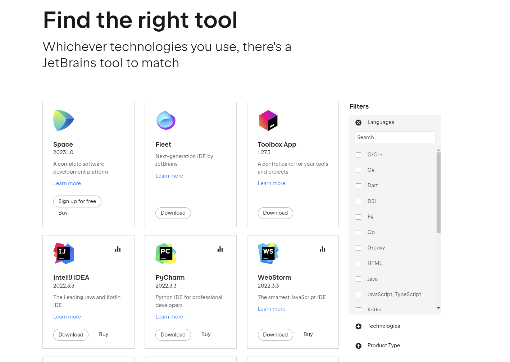

## Strona zadeklarowana dla uczniów technikum "technik programista" 
### *Jekyll theme  [zobacz projekt szablonu Jekyll](http://pages-themes.github.io/hacker) 
### [Skanowanie kalilinux](./Net_scan.md)
### [Git w CMD.exe windows ](./git_windows.md)
### [Zakładanie konta na github](./another-page.md)
### [Schematy blokowe](./algorytmy.md)
### [Strony powiązane. Konkursy dla programisty](http://programista1a.site)
##  W tym roku udało się pozyskać licencje firmy [jetbrains](https://www.jetbrains.com/products)

### zakres algorytmiki w I semestrze klasy pierwszej. 
### 1. Dział algorytmiki. [**Schematy blokowe**](./algorytmy.md)
### 2.[Sortowanie przez scalanie](https://docs.google.com/presentation/d/1mq3bpAIn3--PZhshlFgosCEhWk2N8xHJJfC5mxGxxSU/edit?usp=sharing) 
### 3.[Sortowanie przez wstawianie , zamiane ](https://docs.google.com/presentation/d/13gHVBpA_iJkuVTTfYowHqIpHldESevKfhOLUxLARLNQ/edit?usp=sharing)
### Large image


* * *

### Linki do materiałów pdf:

1. [Python](https://drive.google.com/drive/folders/13pR3LL6UMCNZz09_yeIj3gIQRAQDXww3?usp=share_link)
2. [C++](https://docs.google.com/document/d/1ZwpNzletq-gW2Pj4nE3uNbVGeXjvHTOL/edit?usp=sharing&ouid=117430536303352971908&rtpof=true&sd=true)

### Przydatne strony:
1. [Python](https://python101.readthedocs.io/pl/latest/podstawy/index.html#materialy)
2. [C++](https://cpp0x.pl/kursy/Kurs-C++/1)


```
Long, single-line code blocks should not wrap. They should horizontally scroll if they are too long. This line should be long enough to demonstrate this.
```
