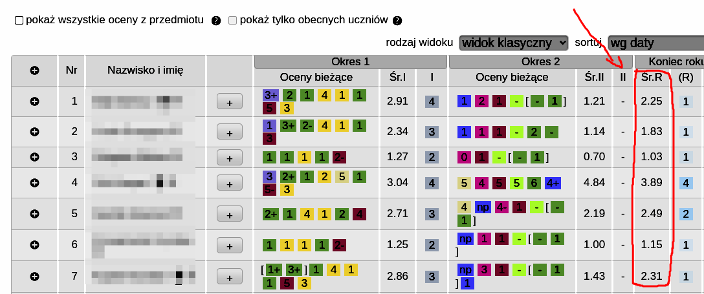
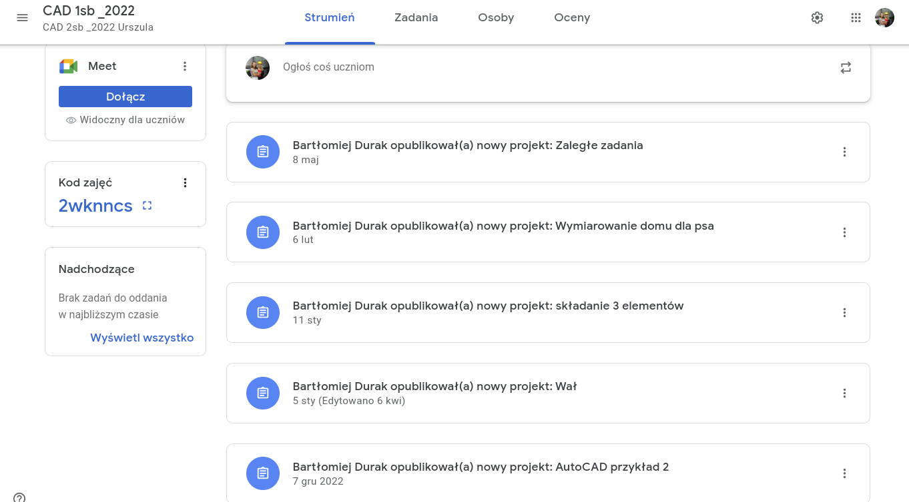

## Strona zadeklarowana dla uczniów ZST
### *Jekyll theme  [zobacz projekt szablonu Jekyll](http://pages-themes.github.io/hacker) 
### [Skanowanie kalilinux](./Net_scan.md)
### [Git w CMD.exe windows ](./git_windows.md)
### [Zakładanie konta na github](./another-page.md)
### [Schematy blokowe](./algorytmy.md)
### [USB bootable](./usbboot.md)
### [Strony powiązane. Konkursy dla programisty](http://programista1a.site)
### [koniec_roku.md](koniec_roku.md)
### Podstawą do wystawienia oceny końcoworoczne jest średnia roczna. Ocena proponowana nie ma znaczenia !


#### 
#### 
### classroom dla klasy 1a sb [2wknncs](https://classroom.google.com/c/NTYxMDE1MzE2OTM1/a/NTUzNzQ0ODExMDUy/details)
### Praca wykonana na lekcji powinna być umieszczona na classroom jako zdjęcie z zeszytu wykonene smartfonem.
### [_Szybki kontakt z nauczycielem przez chat google._](https://mail.google.com/chat)
```
Long, single-line code blocks should not wrap. They should horizontally scroll if they are too long. This line should be long enough to demonstrate this.
```
<!-- Google tag (gtag.js) -->
<script async src="https://www.googletagmanager.com/gtag/js?id=G-0ZDLN5MCQ1"></script>
<script>
  window.dataLayer = window.dataLayer || [];
  function gtag(){dataLayer.push(arguments);}
  gtag('js', new Date());

  gtag('config', 'G-0ZDLN5MCQ1');
</script>