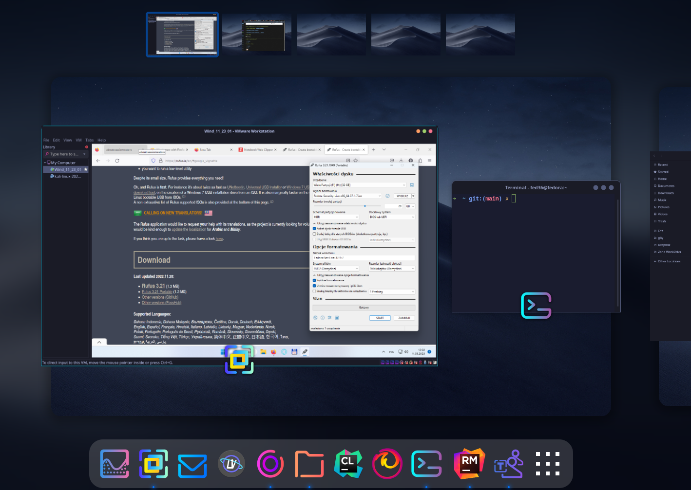
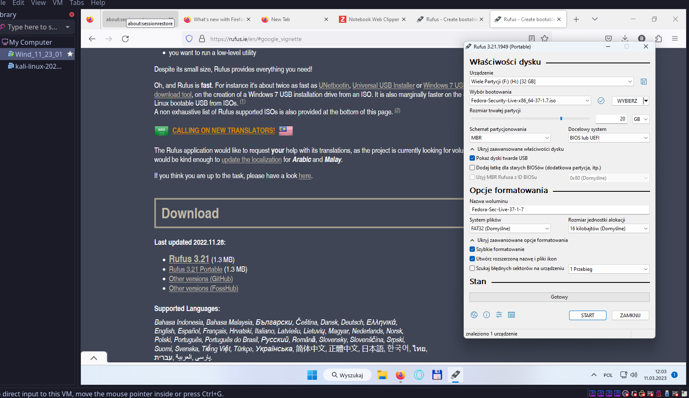
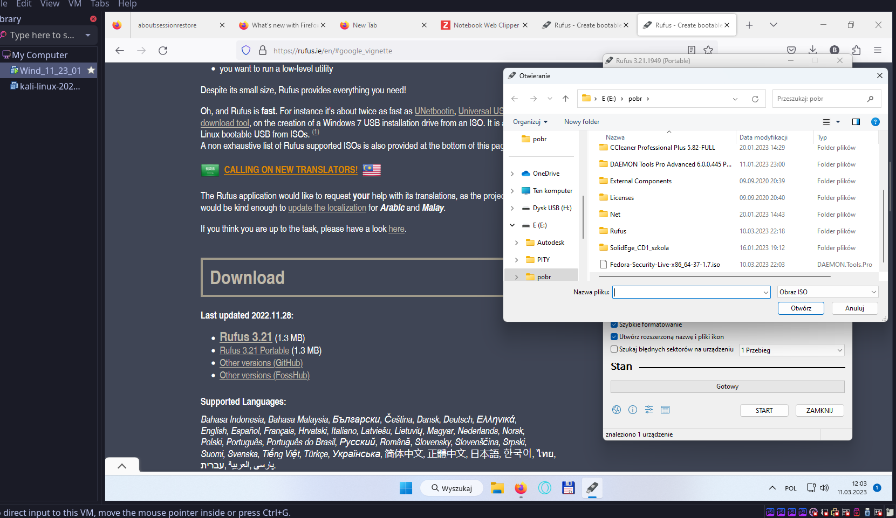
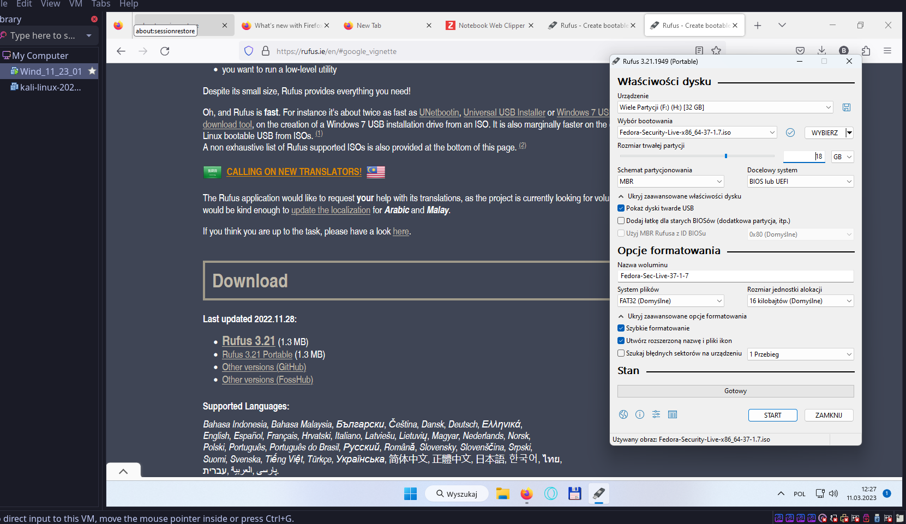
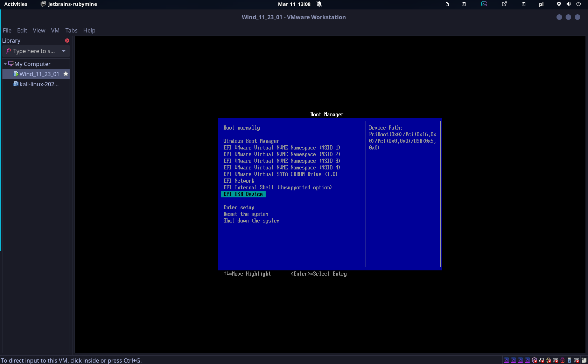
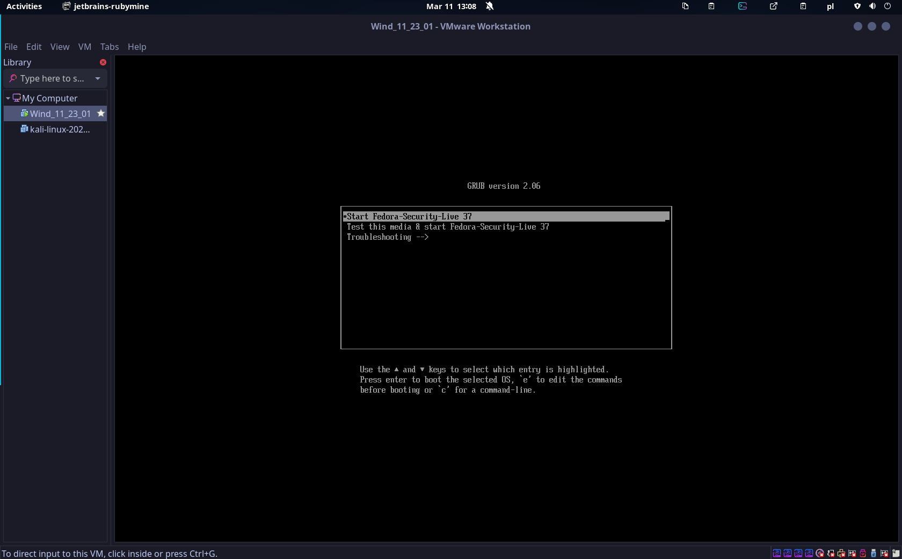
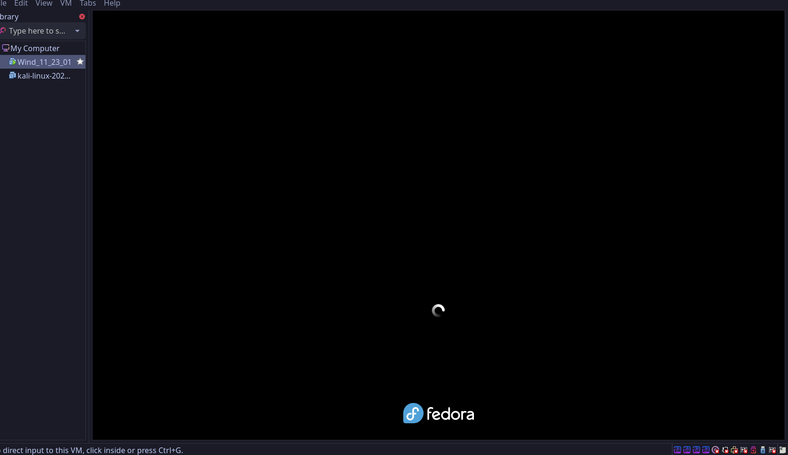
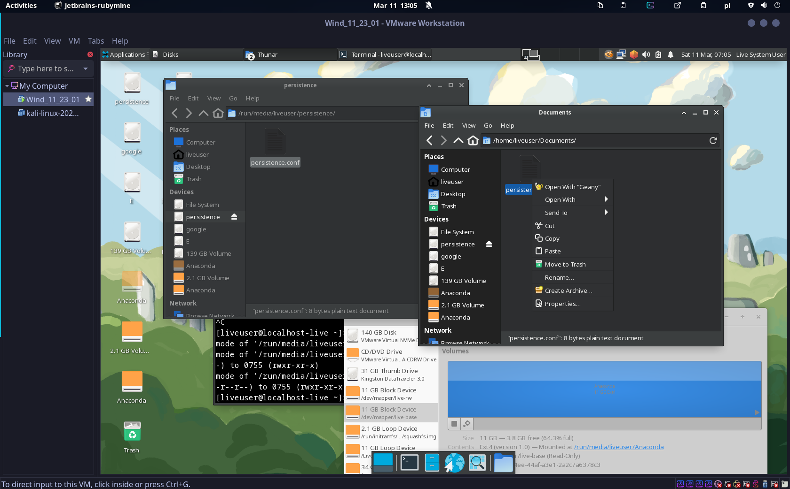

## Strona zadeklarowana dla uczniów technikum "technik programista" 
### [Skanowanie kalilinux](./Net_scan.md)
### [Git w CMD.exe windows ](./git_windows.md)
### [Zakładanie konta na github](./another-page.md)
### [Pen drive USB z systemem boot`owalnym](./usbboot.md)
### [Strony powiązane. Konkursy dla programisty](http://programista1a.site)
## Instrukcja wykonania systemu na usb startującego po wybraniu opcji boot usb w biosie płyty głównej.
#### [Do preparowania dysku użyłem znanego rufus ](./https://rufus.ie/en)
#### [plik źródłowy pobrałem ze strony red hat. Fedora secure](./https://labs.fedoraproject.org/pl/security/)
można pobrać ładne środowiko gnome https://getfedora.org/pl/workstation/
* * *








*przyjżyjcie sie gdzie jest lokalizacja dostępna do zapisu. Jak toś będzie miał trudność. Niech kliknie na pulpit. Pozostała część systemu jest nie zapisywalna*

### Linki do materiałów pdf:

1. [Python](https://drive.google.com/drive/folders/13pR3LL6UMCNZz09_yeIj3gIQRAQDXww3?usp=share_link)
2. [C++](https://docs.google.com/document/d/1ZwpNzletq-gW2Pj4nE3uNbVGeXjvHTOL/edit?usp=sharing&ouid=117430536303352971908&rtpof=true&sd=true)

### Przydatne strony:
1. [Python](https://python101.readthedocs.io/pl/latest/podstawy/index.html#materialy)
2. [C++](https://cpp0x.pl/kursy/Kurs-C++/1)


```
Long, single-line code blocks should not wrap. They should horizontally scroll if they are too long. This line should be long enough to demonstrate this.
```
